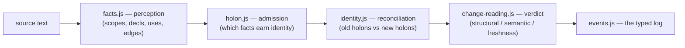

# Code holons — a codebase as one more omnimodal source

> Status: v1 implemented (§§1-6, 9 partial), spec for the rest.
> Canon: `docs/holons.md`, `docs/omnimodal-waveform.md` §2 (the perceiver contract),
> `docs/eo-for-coders.md` (the nine operators, the three faces), `core/operators.js`,
> `core/cube.js`.
> Implementation: `src/perceiver/code/`. Tests: `tests/code-holons.test.js`.

> A codebase is an ordered, nested field of witnessed holons. An edit changes
> witnesses, may preserve anchors, and emits typed transformation events into
> the same evidence system as every other source.

## 0. This is a third code module, not a replacement for the other two

The repo already reads code two other ways, and this doc's first job is to say
exactly how the new one differs, because the names rhyme and the confusion is
cheap to prevent:

- **`src/organs/code/`** (`docs/code-organ.md`) lowers a snapshot of a codebase
  to EOT and folds dependency-order issues out of it — `use-before-INS`,
  `void-binding`, `dead-entity`. It reads **one state of the world** and finds
  what is wrong with it *right now*. It has no concept of "this function used
  to be over there" — every read starts cold.
- **`src/coder/`** (`docs/eot-coder-roadmap.md`) runs the *other* direction:
  EOT blueprint → generated code, checkpointed against the same algebra. It is
  about **producing** code that cannot help but be coherent.
- **`src/perceiver/code/`** (this doc) is neither. It answers a question
  neither module asks: **given two states of the world, what actually
  happened, and how sure are we?** It is the code sibling of
  `src/perceiver/{text,audio,tabular,binary}/` — a perceiver in the
  `docs/omnimodal-waveform.md` §2 sense, except its "Reading" is not a single
  ordered unit stream but a **reconciled pair** of holon sets, because change
  — not a snapshot — is the object code has that a WAV file or a spreadsheet
  does not.

`src/organs/code/facts.js` is not superseded. It is the **perception layer**
this module builds on (§1): the hand-rolled structural reader already gives
scopes, declarations, references, and byte offsets — everything a tree-sitter
CST would, at the grain this codebase needs, with zero new dependency. This
doc's job starts one layer up: which of those facts earn a persistent
identity, and what happened to that identity between two reads.

## 1. Perception vs. admission

The original proposal called for a tree-sitter perceiver. This build does not
add tree-sitter: `organs/code/facts.js` already is the perception layer — a
hand-rolled structural reader emitting scopes, declarations, byte ranges, and
references at the grain a linter reasons at (see `docs/code-organ.md`'s own
framing: *"a grammar-tree provider ... slots in here by producing the same
facts via `registerExtractor` — the organ's laws never change"*). Swapping in
a real CST later costs nothing downstream, because nothing downstream reads
raw syntax — only facts.



Not every scope or declaration becomes a durable holon — that would drown the
signal in punctuation-grade noise. `holon.js` admits exactly:

- the **module** (the file, `facts.module`);
- **classes** (`scope.kind === 'class'`);
- **functions and methods** (`scope.kind === 'fn'` with an `ownerName` — a
  named function declaration, a named function expression, a class method, or
  a `const x = (...) => {}` arrow with a resolvable owner).

Anonymous callback scopes, bare blocks, and individual statements are **not**
admitted as their own holons in v1 — they remain witnessed structure inside
their nearest admitted holon's span (their tokens still feed that holon's
fingerprint, so a change inside an anonymous callback still moves its
enclosing function's fingerprint and is never silently lost). Declaration-
and statement-grain admission (the rest of §1's "likely admitted holons"
list) is future work, noted in §16.

## 2. Witness, anchor, fingerprint

A stable identity cannot be both content-hash-based and path-based while
surviving moves, formatting, and renames — those signals contradict each
other. Three separate coordinates, exactly as proposed:

```js
CodeHolon {
  id,                     // a name-path-keyed handle (§3) — stable across an edit
                           // that leaves the holon's own name and ancestry alone;
                           // a rename or a move earns a NEW id, and it is
                           // identity.js's job, not this field's, to say so
  kind,                    // 'module' | 'class' | 'function'
  witness: {
    path, byteStart, byteEnd, textHash, treeType,   // treeType: the scope kind
  },
  anchor: {
    parentId, structuralSlot, declaredName, signatureShape,
  },
  fingerprint: {
    mechanicalHash,        // comments stripped, whitespace collapsed
    normalizedSyntaxHash,  // + every LOCAL binding alpha-renamed to a position slot
    referenceShapeHash,    // sorted {name,kind} of free (non-local) references
    controlFlowHash,       // the sequence of control keywords (if/for/while/...)
    literalProfileHash,    // the sequence of operator + literal tokens
  },
}
```

`structuralSlot` is the holon's ordinal among same-kind siblings under the
same parent (first function in the module, second method in the class, ...).
`signatureShape` is `paramCount` plus each param's destructuring shape
(`ident` | `rest` | `pattern`), name-blind — a rename of a parameter does not
move it, a parameter added or reordered does.

### 2.1 Five hashes, not three

The proposal's prose (§2) names four fingerprint ingredients — *"normalized
tree; referenced symbols; control-flow shape; literal/type profile"* — but its
code sketch only fields three. That is a real gap, not a simplification: a
literal or comparison-operator edit (`<=` → `<`, fixture #6) changes none of
normalized-tree, reference-shape, or control-flow, and would be invisible to
the fingerprint entirely. `literalProfileHash` closes it.

The other correction: `normalizedSyntaxHash` and `mechanicalHash` are kept as
**two separate hashes**, not one, because they anchor two different rungs of
the equivalence ladder (§6):

- `mechanicalHash` — comments stripped (`facts.js`'s own `scrub`), all
  whitespace collapsed. Unequal exactly when something other than
  formatting/comments changed.
- `normalizedSyntaxHash` — `mechanicalHash`'s input, additionally
  **alpha-renamed**: every identifier declared *inside* the holon's own scope
  subtree (params, and `const`/`let`/`var`/nested function/class decls whose
  `scopeId` descends from the holon's scope) is replaced, at every occurrence
  including its own declaration, by a position-ordinal placeholder
  (`_L0`, `_L1`, ...). Free identifiers — anything declared outside the
  holon — are left untouched, because renaming what a function calls is a
  different, more consequential act than renaming what it calls its own
  local.

Alpha-renaming is the standard PL notion of equivalence-up-to-bound-names; it
turns "did someone rename a local variable" from a heuristic guess into an
exact structural match. `holon.js` builds the local-symbol table once per
holon (first-appearance order over `facts.decls` scoped under it) and both
`identity.js` and `change-reading.js` read the result — that is fixture #3
made precise, not approximated.

## 3. Identity is name-path keyed, not position keyed — and why

The first working version of `holon.js` keyed `id` on structural position:
`hash(path | kind | parentId | structuralSlot)` — "the first function in the
module", "the second method in the class". It has a fatal flaw the fixture
battery caught immediately (fixture #8, extract-function): **inserting a new
sibling anywhere shifts every later sibling's ordinal.** Add a helper function
before an existing one, and the existing one's slot moves from 0 to 1 — its
old-side id (slot 0) no longer matches its new-side id (slot 1), so
`identity.js` read the *unrelated* new function at slot 0 as "the old function,
renamed" and the *actual* old function as vanished. A plain insertion
misread as a rename.

`id` is keyed on the **declared-name path** from the module down instead —
`module>function:total#0`, `module>class:Widget>function:render#0` — with a
`#<occurrence>` suffix disambiguating the rare case of two same-name siblings
under one parent (overloads, accessor pairs). A name path only changes when
something in the holon's own ANCESTOR chain is actually renamed, never when an
unrelated sibling is added or removed anywhere else in the file. `structuralSlot`
stays in `anchor` as positional metadata ("the first function in the module")
— useful for display, no longer load-bearing for identity.

This does mean id equality alone can no longer detect a rename (the new name
is literally part of the key). `identity.js` classifies every holon into
exactly one of:

| category | condition |
|---|---|
| `same` | id matches (same name path), witness text identical |
| `modified` | id matches, witness text differs |
| `renamed` | id has no match, but a residual new-side holon under the SAME `parentId` and kind has an identical full fingerprint |
| `moved` | id has no match, and no same-parent rename candidate; a residual new-side holon ANYWHERE in the file, same kind, has an identical full fingerprint |
| `moved-file` | absent from its old file, a fingerprint-identical holon appears in a *different* file of the same corpus read (cross-file pass, after the per-file pass) |
| `ambiguous` | more than one new-side candidate ties on fingerprint match |
| `added` | no old-side match by any rule above |
| `removed` | no new-side match by any rule above |

The `renamed` pass runs before the broader `moved` pass deliberately: a
same-parent, fingerprint-identical residual pair is almost certainly a rename
in place, and letting the wider cross-file/cross-parent fingerprint search see
it first would risk it losing a tie to an unrelated coincidental match
elsewhere in a large corpus.

No rule manufactures a stable id across an `ambiguous` or `removed` case —
per the proposal's own rule, an unresolved continuation is reported as
unresolved, never silently resolved to whichever candidate sorts first.

Cross-file move detection (`moved-file`) runs as a second pass over whatever
`removed`/`added` residue the per-file pass leaves, matching on the full
fingerprint tuple. This is deliberately conservative: two unrelated one-line
functions that happen to normalize identically (e.g. `(a, b) => a + b` moved
and a *different*, coincidentally-identical arrow added elsewhere) will
report as moved. That is the correct call under precision-over-recall — the
alternative is a false `removed` + false `added` pair.

## 4. ChangeReading — three axes, not five values

The proposal is right that a five-valued verdict conflates two different
questions: *what does this change mean* and *is that judgment still current*.
`change-reading.js` keeps them apart:

```js
ChangeReading {
  structuralChange:  'same' | 'modified' | 'renamed' | 'moved' | 'moved-file' | 'ambiguous' | 'added' | 'removed',
  semanticVerdict:   'changed' | 'equivalent' | 'contested' | 'unknown',
  equivalenceTier:   'mechanical' | 'local' | 'apparent' | null,   // only set when semanticVerdict === 'equivalent'
  evaluationState:   'fresh' | 'stale' | 'pending' | 'failed',
  grounds,           // which hashes/witnesses licensed the verdict, in prose
  level,             // the analysis level that licensed it (§5): 0-2 in v1
  affectedEdges,     // typed dependency edges touched (propagation.js)
}
```

`evaluationState` is `'fresh'` for every reading `readCodeChange` produces
directly (it always reconciles the live pair handed to it) and `'pending'`
only for holons an `AnalysisWitness` (§7) has not yet reported on when one was
requested. `'stale'` and `'failed'` are for a caller that holds a reading
across a *later* edit without recomputing it — `change-reading.js` exposes
`markStale(reading)` for that caller; recomputing it is always correct and
always available, so v1 never invents a stale reading on its own.

### 4.1 The equivalence ladder, made mechanical

Section 6 of the proposal asks for an ordered ladder, not a flat
`equivalent`/`not`. Given the five fingerprint hashes, the ladder is a
priority list of hash-equality checks, most conservative claim last:

| hashes equal (byte-identical excluded) | tier | `semanticVerdict` |
|---|---|---|
| `mechanicalHash` | **mechanical** — whitespace/comments only | `equivalent` |
| `normalizedSyntaxHash` (but not `mechanicalHash`) | **local** — only bound-local identifiers moved | `equivalent` |
| `referenceShapeHash` + `controlFlowHash` + `literalProfileHash` (but not `normalizedSyntaxHash`) | **apparent** — same references, same control shape, same literals; the concrete tree still differs (e.g. independent statements reordered) | `equivalent`, tier `apparent` |
| `declaredName` changed, all five fingerprint hashes unchanged, holon **not exported** | rename, reference sites checked in-corpus (§4.2) | `equivalent` (tier `local`) if every same-corpus reference to the old name resolves to the new one and none remain; else `contested` |
| `declaredName` changed, all five fingerprint hashes unchanged, holon **exported** | public rename | `changed` — a contract severed unless a compatibility alias exists (fixture #4); never asserted equivalent, because external consumers outside the given corpus cannot be checked |
| any of `referenceShapeHash` / `controlFlowHash` / `literalProfileHash` differs | — | `changed` |
| a `NUL` (§5) covers the holon (parse gap, dynamic binding, missing dependency) | — | `unknown` |

Every tier states which hashes licensed it (`grounds`), so a reader never has
to trust an unexplained "equivalent" — `renderVerdict()` prints the sentence
form:

```
Equivalent at the mechanical tier (whitespace/comments only).
Equivalent at the local tier (bound identifiers renamed; free references, control flow, and literals unchanged).
Contested — structure changed; reference shape unchanged; not asserted equivalent (public export).
Changed — literal/operator profile differs.
```

This is the §5 collision resolved without inventing a sixth value: `stale` is
gone from the verdict space entirely (it lives on `evaluationState`), and the
ladder gives the UI exactly the plain-language table the proposal asked for,
generated from the axis pair rather than hand-authored:

| `semanticVerdict` + `evaluationState` | rendered |
|---|---|
| `equivalent` (mechanical) + `fresh` | No meaningful change |
| `changed` + `fresh` | Behavior changed |
| `equivalent` (apparent) + `fresh` | Structure changed; meaning appears equivalent |
| `contested` + `fresh` | Structure changed; meaning contested |
| `unknown` + `fresh` | Meaning could not be determined |
| any verdict + `stale` | Needs reevaluation |

### 4.2 In-corpus rename verification

For a non-exported rename, `identity.js` checks every `use`/`asg`/`upd` in
the **old** file referencing the old name against the **new** file: if zero
references to the old name remain anywhere in the new read and at least as
many references to the new name appear as the old name had, the rename is
verified within the given corpus and the tier is `local`. This is a real,
if narrow, check — not a guess — and its narrowness is stated in the
`grounds` string (`"reference sites checked within the given corpus only"`),
because a call site in a file outside the corpus handed to `readCodeChange`
is invisible to it by construction. Widening this to whole-project resolution
is §16 future work, not a v1 claim.

## 5. Typed NUL

`nul.js` emits `{ kind, reason, span, grounds, retryable }` for exactly the
gaps this level of analysis can detect and name honestly — it does not
attempt the harder gaps (macro expansion, generated-code provenance beyond a
resolvable import) and does not pretend to:

| `reason` | detection |
|---|---|
| `parse-gap` | unbalanced `(`/`{` in the scrubbed source — `facts.js`'s hand-rolled reader is lenient and will not throw on malformed code, so this is a direct brace/paren balance check, not a caught exception |
| `dynamic-binding` | an `eval(` call, or a computed member expression (`obj[expr]`) whose bracket contents are not a string/number literal — the same "invisible to any static reading" limit `facts.js` already documents, now surfaced as a typed gap instead of silent absence |
| `missing-dependency` | an import `edges` entry (relative spec) that resolves, via `resolveSpec`, to no file in the given corpus — the file may exist on disk; the perceiver only knows the files it was handed, so this NUL is honest about scope, not a claim the file doesn't exist |

A `parse-gap` NUL does not delete the file's prior holons: `readCodeChange`
retains the last successfully-admitted holon set for a file that fails to
balance, marks every holon in it `evaluationState: 'stale'`, and reports the
gap — never a silent disappearance (fixture #10).

## 6. Typed dependency edges and propagation

`propagation.js` reads three edge types straight off `facts.js`'s existing
output — it adds no new extraction, only a typed label and a staleness rule
per type:

| edge | source | staleness rule |
|---|---|---|
| `imports` | `facts.edges` (kind `import`/`require`/`dynamic`) resolved against the corpus | a changed **export's signature** stales every importer for *type* analysis; a changed **export's body only** (same signature, `modified`/`equivalent` verdict) stales importers for *behavioral* analysis only |
| `exports` | `facts.exports` | a `removed` exported holon severs the contract — every importer of that name is marked stale, unconditionally |
| `calls` | `facts.calls` (same-module only — `facts.js`'s own documented limit) | a callee's behavioral change stales its same-module callers for behavioral analysis; a callee's signature change stales them for type analysis too |

This is the **soundness gate** (proposal §10): every one of these
propagations always fires, regardless of how small the underlying diff looks
byte-wise. The proposal's own example — `<=` → `<` — is exactly why: it is
one character and `literalProfileHash` differs, so the holon's
`semanticVerdict` is `changed`, and every same-module caller is staled for
behavioral re-analysis whether or not the edit "looks big." There is no
**attention gate** (which changes get surfaced first, rendered prominently,
recomputed first) implemented in v1 — that is a ranking/scheduling layer over
this same soundness data, deferred to §16, and it is not allowed to suppress
anything this section marks stale.

`propagateStaleness(changes, edgesByFile)` returns, per changed holon:

```js
{ holonId, exportName, typeConsumers: [...holonIds], behavioralConsumers: [...holonIds] }
```

— which is exactly the proposal's target sentence: *"Contract changed here. 3
type consumers stale · 0 behavioral consumers stale."*

## 7. Diagnostics as evidence (the seam, not the integration)

`change-reading.js` accepts an optional `analysisWitnesses` list:

```js
AnalysisWitness { analyzer, version, holonId, verdict, diagnostic, timestamp }
```

A witness whose `verdict` disagrees with the structural reading's own
`semanticVerdict` flips the reading to `contested` and appends the witness's
`diagnostic` to `grounds` — `tests/code-holons.test.js` proves this with a
synthetic failing-test witness overriding an `equivalent` (apparent-tier)
reading (fixture #13). No analyzer is wired in: this is the seam, not the
integration — plugging in `node --check`, a real type-checker, or a test
runner is future work (§16) and does not change this module's contract.

## 8. Analysis levels, stated per verdict

Every `ChangeReading.level` names the ceiling of what licensed it, so a
verdict never overclaims:

| level | what it covers | in v1? |
|---|---|---|
| 0 — bytes | exact provenance, byte ranges | yes (witness) |
| 1 — syntax | scopes, nesting, structural diff | yes (`facts.js`) |
| 2 — lexical binding | declarations, same-file/same-corpus references, approximate call edges | yes (`facts.js` + `identity.js`/`propagation.js`) |
| 3 — language semantics | types, overload resolution, effects | no — the seam is §7 |
| 4 — project/toolchain evidence | compiler diagnostics, test results, coverage | no — the seam is §7 |

`renderVerdict()` always appends the level, e.g. *"Equivalent at the local
tier (level 2: lexical binding). Runtime equivalence not established."* — the
proposal's own worked example, generated rather than hand-written.

## 9. Typed operator events

`events.js` walks a corpus reconciliation and a NUL ledger and emits the
proposal's roster as **events describing what a reconciliation pass found**,
never as a permanent label glued onto a syntax kind:

| event | fires when |
|---|---|
| `SEG` | admission draws (or dissolves) a holon boundary — a scope newly qualifies or stops qualifying as a holon |
| `SIG` | a witness is registered — a holon's fingerprint is computed |
| `INS` | a holon is admitted with no old-side match (`structuralChange: 'added'`) |
| `CON` | an import/export/call edge is established between two holons |
| `DEF` | an exported holon's signature is asserted (its `signatureShape` is read as the contract) |
| `SYN` | admission composes lower facts (decls under a scope) into one holon |
| `EVA` | a `ChangeReading` is produced for a holon |
| `REC` | a prior `ChangeReading` is revised by a later `AnalysisWitness` (§7), or a symbol's resolution changes because another file in the corpus changed — **not** fired for an ordinary recursive call, which is a `CON` edge whose endpoints happen to cycle (proposal §3's own correction, kept) |
| `NUL` | an entry from §5's ledger |

`renderEventLog(events)` prints the proposal's own worked example format
(§14) — the typed lines first, the one-sentence plain-language summary
after — and is exercised in the test battery against a real reconciliation,
not a hand-built fixture.

## 10. What is deliberately not built yet

Named here so it reads as scoped, not abandoned:

- **Declaration/statement/expression-grain admission** (§1's fuller list).
  v1 stops at module/class/function because that already answers every
  fixture in the battery; going finer needs an admission-noise study first.
- **Cross-corpus (whole-project) rename/reference verification.** §4.2 is
  honest about being corpus-scoped.
- **Level 3-4 analysis integrations** (a real type-checker, `node --check`,
  test runners, lint). The seam (§7) is built; the wiring is not.
- **The attention gate / MDL ranking layer** (§10 of the proposal). The
  soundness gate is complete; scheduling and prominence are not.
- **The UI**: the code waveform (§11 of the proposal), the two code pages
  (§12), the terrain projections (§13). None of it is started. Per the
  proposal's own instruction, the priority is a reliable `ChangeReading`
  first — the waveform/terrain/pages are projections of it once it exists,
  never the other way round.
- **Additional language adapters.** v1 covers exactly what
  `organs/code/facts.js` covers: JavaScript/TypeScript. `python.js`, `go.js`,
  `rust.js` already exist as fact providers in `organs/code/`; wiring them
  into holon admission is a follow-up, not a redesign — `holon.js` consumes
  the fact shape, not the language.

## 11. The fixture battery

`tests/code-holons.test.js`, against the proposal's own list (§15). Each
proves the exact expectation stated, not a loosened version of it:

| # | edit | proves |
|---|---|---|
| 1 | whitespace-only | `equivalent`, tier `mechanical` |
| 2 | comment-only | `equivalent`, tier `mechanical` |
| 3 | local variable rename | anchor preserved, `equivalent`, tier `local` |
| 4 | public function rename | `changed` (contract severed; no alias) |
| 5 | literal change | `changed`, `literalProfileHash` differs |
| 6 | `<=` → `<` | `changed` despite a one-character diff |
| 7 | function moved to another file | `structuralChange: 'moved-file'`, import edges recomputed |
| 8 | extract-function refactor | `changed`/new holon `added`, never asserted equivalent |
| 9 | removed export | contract severed; importers staled unconditionally |
| 10 | syntax error mid-edit | prior holons retained, `evaluationState: 'stale'`, typed `parse-gap` NUL — no disappearance |
| 11 | dynamic property lookup | typed `dynamic-binding` NUL, `semanticVerdict: 'unknown'` |
| 12 | missing dependency | typed `missing-dependency` NUL |
| 13 | analyzer witness disagrees with an apparent-tier equivalence | `contested`, `grounds` cites the witness |
| 14 | reverted edit (A→B→A) | identity (`anchor`+`fingerprint`) recovered on the second edit; both edits' events remain in the accumulated log |

## 12. Run it

```js
import { readCodeChange } from './src/perceiver/code/index.js';

const before = [{ path: 'src/a.js', text: oldText }];
const after  = [{ path: 'src/a.js', text: newText }];

const { changes, events, nulls, propagation, report } = readCodeChange(before, after);

console.log(report);
// src/a.js:12 export function perceive — changed (literal/operator profile differs)
//   3 type consumers stale · 0 behavioral consumers stale
```
