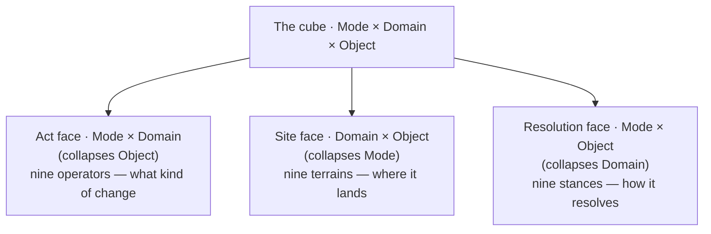

# The Cube — Master Spec

*Self-contained and authoritative. Merges and supersedes the site-grid note, the cube-and-system-edits spec, and the Resolution-face spec. Assumes no prior reading.*

> ## As built — implementation status
>
> The cube is named in full in `src/core/cube.js`, which is the authority for the
> third axis (Object grain) and the two faces that ride it — the Resolution face
> (the nine **stances**) and the Site face (the nine **terrains**). `core/operators.js`
> remains the authority for the Act face. The address derived in `core/address.js`
> now carries `resolution.stance` and `site.terrain` alongside their coordinates,
> so a single event reads off all three faces.
>
> Wired from the System-edits list below:
>
> - **Edit #1 (Object-diagonal coherence).** `coherence(event)` / `isDiagonal(event)`
>   in `core/cube.js` validate that operator-grain, stance-grain (Resolution) and
>   terrain-grain (Site) agree and that the shared Mode and Domain agree across the
>   faces. The 27 legal cells are `DIAGONAL_CELLS`; `tests/cube.test.js` binds them
>   to `data/phasepost-cells.json` so either drifting fails loudly. The Kafka
>   confabulation (Making at a Void) is rejected off-diagonal there.
> - **Edit #2 (read/write signatures from Mode).** `signatureOf(op)` derives the
>   dependency arrow's read/write declaration from the operator's Mode.
> - **Edit #3 (import-time alias table).** `aliasOperator` / `aliasCellKey` and
>   `OPERATOR_ALIASES` map a stale corpus forward; `classify/centroids.js` applies
>   the alias when ingesting a centroid bundle.
>
> **Two naming reconciliations between this prose and the code.**
>
> 1. **Domain name.** The Site face below calls the third domain *Significance*;
>    the operator vocabulary (`core/operators.js`) calls that same domain
>    *Interpretation*. They are the same row — Atmosphere / Lens / Paradigm.
> 2. **Alias direction.** The alias is **SUP → EVA, ALT → DEF**, fixed by the cube
>    geometry rather than the spelling of the old name: SUP's exemplar cells
>    (Binding / Tending / Tracing) are all Relate-mode → EVA; ALT's cells
>    (Dissecting / Clearing / Unraveling) are all Differentiate-mode → DEF. The
>    already-renamed centroid bundle (`data/centroids-27.json`,
>    `operator_rename: {ALT: DEF, SUP: EVA}`) carries this direction, and the Act
>    face and Edit #3 below have been corrected to match it. (Earlier drafts of
>    this spec stated the alias backwards, "SUP to DEF, ALT to EVA"; the verified
>    corpus and the shipped bundle are the committed reading, so we corrected the
>    prose forward to match the data — we never rewrite the keys to match prose.)

## The cube

Everything is generated from one structure: a cube with three axes, three values each.

- **Mode** — Differentiating, Relating, Generating. *What kind of change.*
- **Domain** — Existence, Structure, Significance. *What order of question.*
- **Object** — Ground (−1), Figure (+1), Pattern (√2). *At what grain.*

Each face collapses one axis and carries the other two.

Every event has three components: an **operator** (Act face), a **site** (Site face), and a **resolution**, its stance (Resolution face). The three share axes pairwise, so a coherent event sits where they agree. Because Object is shared by all three faces, a coherent event lies on the **Object diagonal**: operator-grain, site-grain, and resolution-grain are the same. The 27 diagonal cells are the legal events; the other 702 triples are contradictions. This rule does more work than anything else in the system.

## The Act face — Mode × Domain — the operators

|                  | Existence | Structure | Significance |
|------------------|-----------|-----------|--------------|
| Differentiating  | NUL       | SEG       | DEF          |
| Relating         | SIG       | CON       | EVA          |
| Generating       | INS       | SYN       | REC          |

> Note: **DEF** is Differentiating × Significance (the *assert/define* distinction)
> and **EVA** is Relating × Significance (the *evaluate-frames* relation). This is
> what the verified centroid keys carry — `DEF_Dissecting_Lens` (DEF on a
> Differentiate-mode stance), `EVA_Binding_Lens` (EVA on a Relate-mode stance) —
> and what `core/operators.js` and `DIAGONAL_CELLS` encode. (Earlier drafts of
> this table swapped EVA and DEF; corrected here to match the data it depends on.)

The **reading loop is the Significance column** — DEF, EVA, REC, the three meaning-domain operators run across the three Modes. The loop relates a figure to a significance (EVA, Relating), differentiates it from its rivals (DEF, Differentiating), and generates forward (REC, Generating). It ends on the one Generating operator, which is why that step is gated.

**Naming, corrected.** The current operators are DEF and EVA. SUP and ALT are *old* names. The corpus archetype build dated 2026-04-24 still carries the stale names (and, in some records, old stance names). This is a stale-record problem in the data, not the architecture. The fix is an **import-time alias table** mapping the corpus forward, applied when ingesting exemplars or centroids. We never rename the system to match the corpus; we map the corpus forward. The architecture eats its own dogfood: the corpus is a committed reading under an earlier lens, the rename is a later defeat event, and append-only means we alias forward rather than rewrite the record. (See the As-built note for the corrected SUP/ALT direction.)

## The Site face — Domain × Object — the terrains

|                  | Ground | Figure | Pattern |
|------------------|--------|--------|---------|
| **Existence**    | Void   | Entity | Kind    |
| **Structure**    | Field  | Link   | Network |
| **Significance** | Atmosphere | Lens | Paradigm |

The Structure row splits what was once loosely called "the structure graph" into three terrains: the wave fold operates at **Field**, surgical defeat at **Link**, the dependency schedule and cycle-detection at **Network**. The **Ground column** — Void, Field, Atmosphere — is the ambient medium the reader rides, three *fields*. The Figure and Pattern columns are inscribed into those fields.

The floor lives in this face. A frame gap is most often a missing **Kind** (Existence × Pattern) — a relation-type the ingestion frame never made available — distinct from a missing Entity or a genuine Void. The system must tell those apart.

## The Resolution face — Mode × Object — unpacked

This is the face developed least and deciding most, because it is the **how** of every event. It collapses Domain, carrying direction and grain but no territory. Strip away where an event happens and the move itself survives: the Resolution face is the verb face.

### The Mode axis is the engine of direction

The three Modes are a polarity, and they are not symmetric.

- **Differentiating** is subtractive — takes apart, separates, distinguishes, voids. *Reads a site and may cut it.*
- **Relating** is connective — ties this to that. *Reads two sites and writes a link.*
- **Generating** is additive — produces what was not there. *Writes a new site.*

This is the surfing regime, exactly. Reading is Differentiating; navigation is Relating; generation is Generating. The reason generation is the dangerous move is structural: **Generating is the only additive Mode**, the only one that cannot be checked against something already present, which is why the seam — the one Generating step in the loop — earns the gate.

The Mode axis is also where the **arrow of time** comes from. The dependency graph's read/write signature for any event is given by its Mode (`signatureOf` in `core/cube.js`): Differentiating reads-and-voids, Relating reads-two-writes-a-link, Generating writes-new. So **Resolution is the time axis of the cube and Site is the space axis** — the operator acts in both at once.

### The Object axis is grain

Ground (−1), Figure (+1), Pattern (√2). Ground is the ambient condition, ridden not committed. Figure is the specific committed thing. Pattern is the type, the regularity, the diagonal — the √2 is literal: the Pattern is the diagonal relation between grounds and figures, irreducible to either.

### The nine stances

|                  | Ground | Figure | Pattern |
|------------------|--------|--------|---------|
| Differentiating  | Clearing | Dissecting | Unraveling |
| Relating         | Tending  | Binding    | Tracing    |
| Generating       | Cultivating | Making  | Composing  |

Clearing dissolves ambient conditions. Dissecting takes a specific thing apart. Unraveling deconstructs a regularity. Tending maintains conditions. Binding connects specific things. Tracing maps regularities across time. Cultivating produces conditions for emergence without producing the thing — the emptiest cell. Making builds — the gravity well, the densest cell in every language. Composing produces regularities.

### The diagnostic asymmetry, and the error it predicts

Making is the gravity well — the densest, most sharply recognized stance. Cultivating and Unraveling are the deserts — sparse, diffuse, easily confused with neighbors. The discriminability gradient is **Figure over Pattern over Ground**. Single-tag classification fidelity is low overall, which is why a cube tag is never a fact.

This predicts a specific failure. Reaching for a resolution, the system is pulled toward Making and away from Cultivating. So it will **Make where it should Cultivate, or Make where it should Clear.** This is the category error: a Figure-grain fix applied to a Ground-grain problem.

And here is the payoff that binds the Resolution face to the Site face through the diagonal rule. **The category error is an off-diagonal event.** The Kafka confabulation, "illness or injury," is a **Making** — Generating × Figure — at a **Void** site — Existence × Ground. Making's grain is Figure; Void's grain is Ground; they do not match; the event is off-diagonal; coherence rejects it. The diagonal-coherent resolution at a Void is a Ground-grain move — Clearing the expectation, Tending the condition, or reporting the void — never Making a Figure.

## The recursion is the Domain axis

The Significance row is the Existence and Structure rows applied to stances instead of content. Atmosphere is the void-and-field of significance, Lens is the entity-and-link of significance, Paradigm is the kind-and-network of significance. Moving down the Domain axis from Existence to Structure to Significance **is** the recursion, built into the generator.

A **Lens** is a frame and a modality. **Frame-abduction is an INS at the Lens site**. **Learning is defeat climbing the Domain axis**: a chronic, shaped Void at the Existence level is an undercutter against the Lens that failed to fill it; the warrant for the current Lens sags, defeat fires, the system recurses to a better stance. A **paradigm shift** is a defeat at the Paradigm site that re-admits which Lenses may be ground — and it is exactly where the under-read-versus-mis-framed question resolves: under-read is thinness at the Lens, mis-framed is a defeat at the Paradigm.

## Omnimodality is Links across Lenses

A modality is a Lens. A cross-modal correspondence is a **Link** (Structure × Figure) whose endpoints are readings made under two different Lenses. An inter-modal disagreement is a **fork at a Link across Lenses**. Cross-modal Links are **high on the ladder** — sparse, paired-data-hungry — so the system is reliable inside each modality and thin at the seams. Emit those Links thin, marked inferred, defeated first. Omnimodality buys *honest* cross-modal reading, not confident cross-modal reading.

## What this changes in surfing

The surf is the Significance column of the Act face — DEF, EVA, REC — but it has run that column over only one cell of the Significance row's terrain: the **Lens** (Significance × Figure). The row has three terrains; the surf is blind to two.

**Add an Atmosphere pass beneath the Lens.** The meaning-read should ride an **Atmosphere** before committing any figure-level reading — registering that a passage *reads as evasive* before it can name the evasive clause.

**Add a Paradigm pass above the Lens.** Deciding the Lens itself is wrong is a Pattern-grain move at the Significance level — a Paradigm operation, not a Lens one. This is where mis-framed separates from under-read.

**Each pass takes its proper stance-grain.** Riding the Atmosphere (Ground) is a Ground-grain resolution — Tending or Clearing. Committing at the Lens (Figure) is a Figure-grain resolution — Binding, Dissecting. Working the Paradigm (Pattern) is a Pattern-grain resolution — Tracing, Composing, Unraveling. Crossing grains inside the surf is the same category error the diagonal forbids.

## System edits

Ordered by leverage. Each is concrete.

1. **Enforce Object-diagonal coherence, and recognize it as the confabulation guard.** Validate on every event that operator-grain, site-grain, and resolution-grain agree, and that the shared Mode and Domain agree across faces. Only the 27 diagonal cells are well-formed. *(Wired: `coherence` / `isDiagonal` / `DIAGONAL_CELLS` in `core/cube.js`.)*
2. **Derive read/write signatures from Mode.** Hand-declared signatures that disagree with the Mode are bugs. *(Wired: `signatureOf` / `SIGNATURES`.)*
3. **Install the import-time alias table.** Map the stale corpus forward — **SUP → EVA, ALT → DEF** (the Mode of each old operator's stances decides it: SUP's stances are Relate-mode → EVA, ALT's are Differentiate-mode → DEF). Alias at ingestion; never rewrite the record; never rename the system. *(Wired: `aliasOperator` / `aliasCellKey`, applied in `classify/centroids.js`.)*
4. **Classify on the diagonal, tag defeasibly.** Tagging one component constrains the other two — tag the most reliable component first and let coherence prune the rest. A tag is never a fact.
5. **Stand up the three Ground fields, building Atmosphere first.** The significance-tone field at Atmosphere is unbuilt and is the highest-value hole the cube exposes.
6. **Give the surf the full Significance column.** Atmosphere pass beneath the Lens, Paradigm pass above it, each holding its proper stance-grain.
7. **Guard the seam for grain, not just timing.** The gate must check the grain of the resolution against the grain of the site.
8. **Floor the recursion with witness-does-not-decide.** Ascend the Domain axis only when the current Lens is genuinely defeated; log each re-frame as an append-only event carrying its surprise-delta.
9. **Emit cross-modal Links thin.** Honest omnimodality, not confident omnimodality.

## One line

The Act face is what kind of change, the Site face is where it lands, the Resolution face is how it resolves — direction and grain without territory, the time axis of the cube. The reading loop is the Significance column; the recursion is the Domain axis; learning is defeat climbing it; omnimodality is Links across Lenses. And the deepest consequence of unpacking the Resolution face is that the category error, the confabulation, and the off-diagonal event are one thing: a move whose grain does not match its ground.
